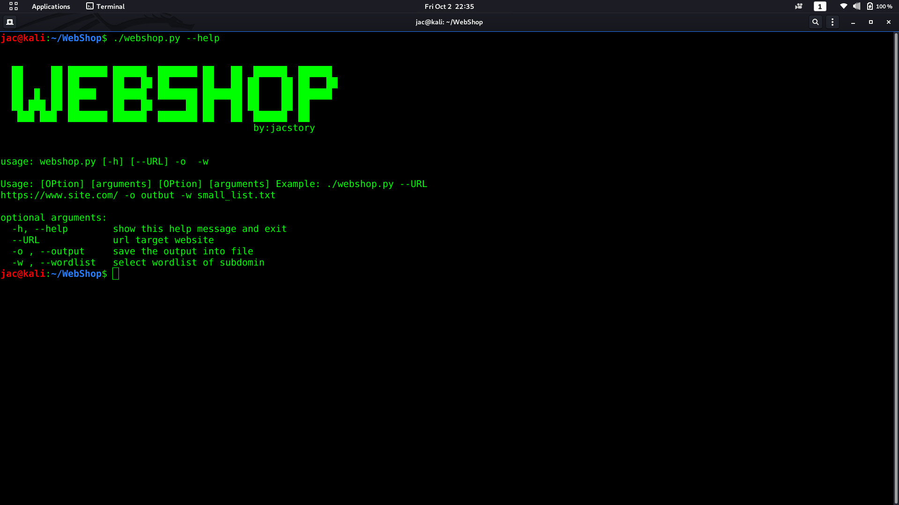
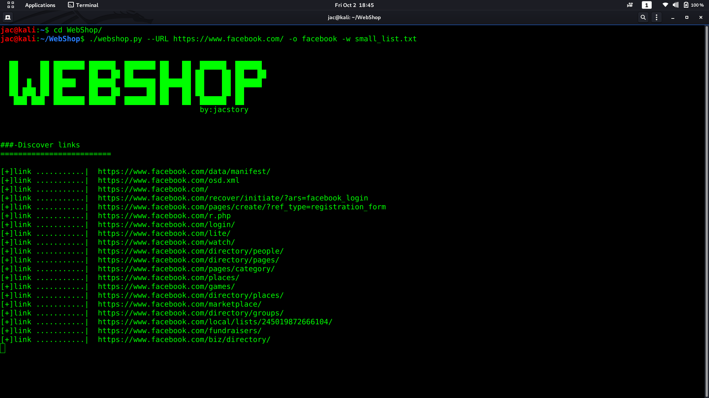
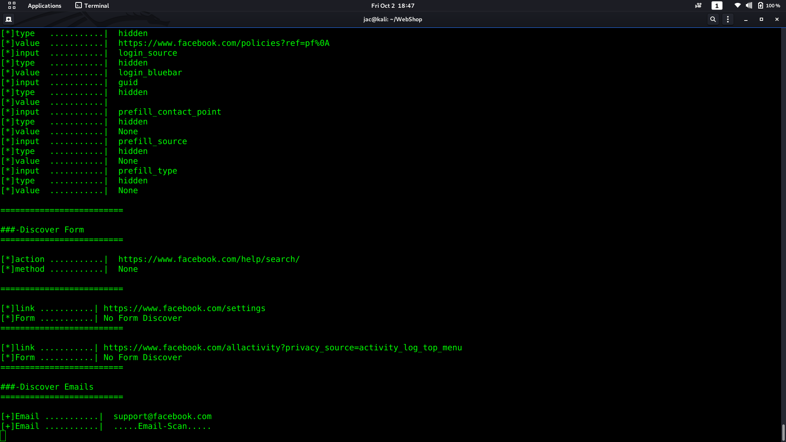
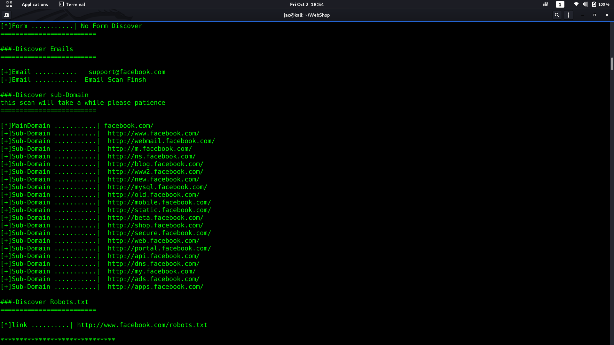
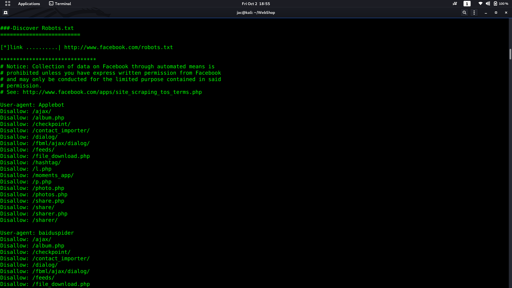

# WebShop 

* webshop python 2.7
* be sure using python2 to make the code function wall
### why this name 
* this name come from the shopping idea so if you go to hybermarket to buy so many items from one place so web  same like the  
hybermarket and the information same like items 
so we going to shopping  "links , forms , emails ,subdomains and robots.txt "

## required
* If you run Debian or Ubuntu, you can install Beautiful Soup with the system package manager
* apt-get install python-bs4
* pip install requests
* pip install beautifulsoup4
* link down below  have some Solutions if you get any problme with beautifulsoup4
* https://www.pythonforbeginners.com/beautifulsoup/beautifulsoup-4-python/

## how to use 

* git clone https://github.com/jac11/WebShop
* cd WebShop/
* chmod +x webshop.py
* to check all  option open help menu by typing ./webshop.py -h or --help
* all OPtions are required "--URL https://.....etc/"," - o file output " , "-w wordlist subdomains " 
* the webshop  have 4 wordlist subdomains 
* 1- small_list.txt it have  100 subdomains names
* 2- medium_list.txt it have 1000 subdomains names
* -3 large_list.txt it have 5000 subdomains names
* -4 big_large.txt it have almos 10000 subdomains names
* so you can selcet  list to sacn subdomains  
* also you can use specific list just pass the wordlist path 

##  [ help menu overview ]
 

### ScreenShot
    
 
 
 *sorry for using facebook , this for teacging purposes

### [for Connect]
* administrator@jacstory.tech
* thank you 

